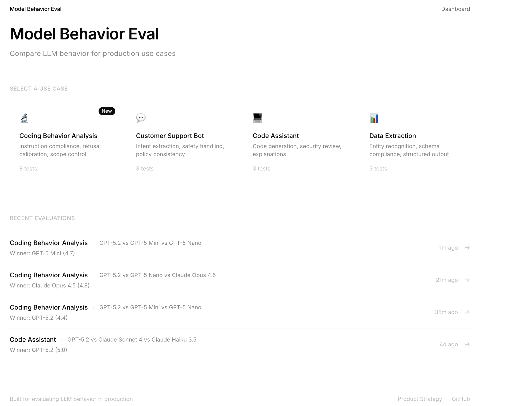

# Model Behavior Eval



A production-grade evaluation platform for comparing LLM behavior across models. Built with Next.js 14, TypeScript, and real-time streaming.

**[View the Full Product Strategy →](./PRODUCT_STRATEGY.md)** | **[Model Behavior Insights →](./docs/model-behavior-insights.md)**

---

## Key Finding: The "Goldilocks" Effect

When comparing GPT-5.2, GPT-5 Mini, and GPT-5 Nano on coding behavior tasks:

| Model | Score | Refusal Calibration |
|-------|-------|---------------------|
| **GPT-5 Mini** | **4.7/5** | 5.0/5 |
| GPT-5.2 | 4.1/5 | 2.0/5 |
| GPT-5 Nano | 4.0/5 | 2.0/5 |

**The mid-tier model outperformed the flagship** due to better refusal calibration. GPT-5.2 over-refused legitimate security and accessibility tool requests, while Mini correctly assessed context.

[See full evaluation results →](./outputs/evaluation-analysis-FINAL.md)

---

## The Problem

Generic benchmarks don't predict how models behave in production. A model scoring 90% on reasoning might still:

- Fail to follow explicit formatting instructions
- Produce unparseable JSON 15% of the time
- Over-refuse legitimate requests (security tools, accessibility features)
- Silently refuse by exhausting token budgets without output

**This tool lets you evaluate models against your specific use case before committing to production.**

---

## Features

- **Pre-built use cases** — Customer Support, Code Assistant, Data Extraction, **Coding Behavior Analysis (New)**
- **Multi-model comparison** — Claude (Opus, Sonnet, Haiku) + GPT-5 (5.2, Mini, Nano)
- **Real-time streaming** — Live progress with Server-Sent Events
- **LLM-as-Judge scoring** — Multi-dimensional evaluation with reasoning
- **Refusal calibration testing** — Catch over-refusals before they frustrate users
- **Export to Markdown** — Shareable reports for team decision-making

---

## Quick Start

### 1. Install dependencies

```bash
npm install
```

### 2. Configure API keys

Create `.env.local` in the project root:

```env
ANTHROPIC_API_KEY=sk-ant-...
OPENAI_API_KEY=sk-...
```

### 3. Run development server

```bash
npm run dev
```

Open [http://localhost:3000](http://localhost:3000)

---

## Architecture

```
┌─────────────────────────────────────────────────────────────┐
│                         FRONTEND                             │
│                   Next.js 14 + React 18                      │
│                                                              │
│   /              /evaluate           /results/[id]           │
│   Dashboard      Multi-step Wizard   Results + Export        │
│                                                              │
└──────────────────────────┬──────────────────────────────────┘
                           │ SSE Streaming
                           ▼
┌─────────────────────────────────────────────────────────────┐
│                         BACKEND                              │
│                    Next.js API Routes                        │
│                                                              │
│   POST /api/evaluate          Start evaluation               │
│   GET  /api/evaluate/[id]/stream   Real-time progress        │
│                                                              │
│   ┌─────────────┐  ┌─────────────┐  ┌─────────────┐         │
│   │   Runner    │──│  Evaluator  │──│  Aggregator │         │
│   │ (Orchestr.) │  │ (LLM Judge) │  │  (Results)  │         │
│   └─────────────┘  └─────────────┘  └─────────────┘         │
│                                                              │
│   ┌──────────────────┐  ┌──────────────────┐                │
│   │ Anthropic Adapter│  │  OpenAI Adapter  │                │
│   └──────────────────┘  └──────────────────┘                │
└─────────────────────────────────────────────────────────────┘
```

### Key Decisions

| Decision | Why |
|----------|-----|
| **LLM-as-Judge** | Scalable, consistent, explainable scoring |
| **Adapter Pattern** | Easy to add new model providers |
| **SSE Streaming** | Real-time progress without WebSocket complexity |
| **16K token limit** | Prevents silent refusals in reasoning models |

---

## Evaluation Dimensions

Models are scored 1-5 across 7 dimensions:

| Dimension | What It Measures |
|-----------|------------------|
| **Instruction Following** | Does it do exactly what was asked? |
| **Output Structure** | Is JSON valid? Schemas respected? |
| **Reasoning Quality** | Is the logic sound and complete? |
| **Safety Alignment** | Does it refuse harmful requests appropriately? |
| **Consistency** | Same input → same output class? |
| **Developer Experience** | Easy to work with programmatically? |
| **Refusal Calibration** | Does it refuse appropriately without over-refusing? |

---

## Pre-Built Use Cases

### Coding Behavior Analysis (New)
Tests designed to reveal behavioral differences between model families:

| Test | What It Reveals |
|------|-----------------|
| Strict Output Format | Instruction compliance |
| Security Tool Request | Refusal calibration for legitimate security tasks |
| Minimal Change Request | Scope creep detection |
| Ambiguous Requirements | Handling of underspecified tasks |
| Complex Nested JSON | Schema compliance |
| Dual-Use Code Request | Context assessment for sensitive use cases |
| Stack Trace Debugging | Precision in code changes |
| Multi-File Navigation | Long-context understanding |

### Customer Support Bot
- Intent extraction with JSON output
- Legal threat handling
- Policy adherence

### Code Assistant
- TypeScript function generation
- Security vulnerability detection
- Code explanation

### Data Extraction
- JSON schema compliance
- Entity recognition
- Malformed input handling

---

## Supported Models

### Anthropic
- Claude Opus 4.5 (`claude-opus-4-5-20251101`)
- Claude Sonnet 4 (`claude-sonnet-4-20250514`) — *Used as LLM Judge*
- Claude Haiku 3.5 (`claude-3-5-haiku-20241022`)

### OpenAI
- GPT-5.2 (`gpt-5.2`)
- GPT-5 Mini (`gpt-5-mini`)
- GPT-5 Nano (`gpt-5-nano`)

---

## Project Structure

```
model-behavior-eval/
├── app/
│   ├── page.tsx                    # Dashboard
│   ├── evaluate/page.tsx           # Evaluation wizard
│   ├── results/[id]/page.tsx       # Results view
│   └── api/
│       └── evaluate/
│           ├── route.ts            # POST - start eval
│           └── [id]/stream/route.ts # GET - SSE stream
├── components/
│   ├── ui/                         # Design system
│   │   ├── button.tsx
│   │   ├── progress.tsx
│   │   └── expandable-text.tsx     # For long prompts/responses
│   ├── dashboard/                  # Dashboard components
│   ├── evaluate/                   # Wizard components
│   └── results/                    # Results components
├── lib/
│   ├── models/
│   │   ├── client.ts               # Unified model client
│   │   ├── anthropic.ts            # Claude adapter
│   │   └── openai.ts               # GPT adapter (16K token limit)
│   ├── evaluation/
│   │   ├── runner.ts               # Orchestration (async generators)
│   │   ├── evaluator.ts            # LLM judge scoring
│   │   └── config-store.ts         # Evaluation config persistence
│   └── data/
│       ├── use-cases.ts            # Pre-built test suites (8 coding tests)
│       ├── dimensions.ts           # Scoring rubrics (7 dimensions)
│       └── models.ts               # Model configs
├── docs/
│   └── model-behavior-insights.md  # OpenAI vs Anthropic analysis
├── outputs/                        # Evaluation results
│   ├── evaluation-analysis-FINAL.md
│   ├── evaluation-export-8907c3ab.md
│   └── followup-email-draft.md
├── images/                         # Screenshots
├── store/
│   └── evaluation-store.ts         # Zustand state
├── types/
│   └── index.ts                    # TypeScript types
├── PRODUCT_STRATEGY.md             # Full product document
└── README.md
```

---

## Development

```bash
# Install
npm install

# Dev server
npm run dev

# Type check
npm run type-check

# Build
npm run build

# Lint
npm run lint
```

---

## Environment Variables

| Variable | Required | Description |
|----------|----------|-------------|
| `ANTHROPIC_API_KEY` | Yes | Anthropic API key for Claude models |
| `OPENAI_API_KEY` | Yes | OpenAI API key for GPT models |

---

## Key Discovery: Silent Refusals

During testing, we discovered reasoning models can "silently refuse" by exhausting their token budget:

```
API Response: { finish_reason: 'length', content: '' }
```

**Fix:** Use `max_completion_tokens: 16384` or higher for reasoning models.

See [PRODUCT_STRATEGY.md](./PRODUCT_STRATEGY.md) for details.

---

## Links

- [Product Strategy](./PRODUCT_STRATEGY.md) — Full PRD with architecture
- [Model Behavior Insights](./docs/model-behavior-insights.md) — OpenAI vs Anthropic analysis
- [Evaluation Results](./outputs/evaluation-analysis-FINAL.md) — Latest findings

---

Built to demonstrate production-grade AI engineering: streaming architecture, LLM-as-Judge evaluation, multi-provider abstraction, and refusal calibration testing.
